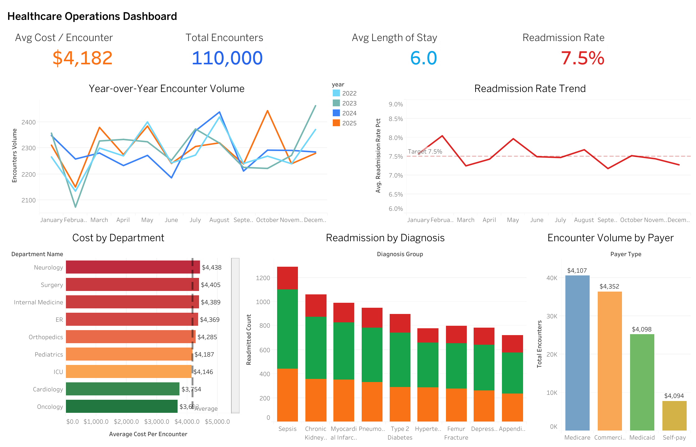

# 🏥 Healthcare Hospital Ops Analytics


*A high-level view of the final Tableau dashboard visualizing Hospital KPIs.*

## 📖 Overview
Hospitals face constant challenges in reducing Length of Stay (LOS), minimizing readmission rates, and managing cost per encounter, all while trying to increase department throughput and bed capacity utilization. 

This project simulates a **Healthcare Hospital Operations Analytics** end-to-end data pipeline. Real patient data is restricted by HIPAA and other regulations, so this project uses a Python-based synthetic data generator to create highly realistic encounter-level data.

The data flows through a modern data stack:
1. **Python** (Synthetic Data Generation)
2. **GCP BigQuery** (Cloud Data Warehouse)
3. **dbt Core** (Data Transformation & Testing)
4. **Tableau Public** (Data Visualization via exported CSVs)

---

## 🏗️ Project Architecture & Components

*   **`pipelines/generate_synthetic.py`**: A Python script using `pandas`, `numpy`, and `Faker` to generate realistic star-schema data (Dimensions: Date, Hospital, Department, Diagnosis, Patient. Facts: Encounters, Costs, Readmissions).
*   **`pipelines/load_to_bigquery.py`**: A Python script that infers schema using pandas and fast-loads the data into the **GCP BigQuery** `raw` dataset.
*   **`dbt/` (Data Build Tool)**: Contains our transformation logic perfectly mapped for BigQuery SQL syntax.
    *   **Staging Models (`stg_*`)**: Clean up and establish the base views from the `raw` tables.
    *   **Marts (`mart_*`)**: Business-level aggregated tables combining facts and dimensions to answer specific KPIs (e.g., daily KPIs, department KPIs, readmission drivers, cost drivers).
    *   **Tests (`schema.yml`)**: Asserts data quality (uniqueness, non-null values, referential integrity, and accepted value constraints).
*   **`pipelines/export_marts_for_tableau.py`**: Extracts the finalized dbt mart tables from BigQuery into clean CSVs inside the `exports_gcp_bigquery/` and `exports/` folders.

---

## 🚀 Step-by-Step Execution Guide

### Prerequisites
Make sure you have the following installed:
*   [Python 3.9+](https://www.python.org/downloads/)
*   A Google Cloud Project (`GCP_PROJECT` in `.env`).
*   A loaded `.json` service key pointing locally via `GOOGLE_APPLICATION_CREDENTIALS` in `.env`.
*   `make` (Usually pre-installed on Mac/Linux)
*   [Tableau Public](https://public.tableau.com/en-us/s/) (For the final visualization step)

### Step 1: Initial Setup
Clone the repository and run the setup command. This will create a virtual environment, install the required Python packages (including dbt-bigquery), copy the environment variables template, and create necessary directories.

```bash
make setup
```

### Step 2: Generate Synthetic Data
Run the data generator to create realistic hospital data (2022-2025). This will populate the `data/synthetic/` folder with 8 CSV files representing our dimensions and facts.

```bash
make gen-data
```
*Verification:* Check the `data/synthetic` directory. You should see files like `dim_patient.csv`, `fact_encounters.csv`, etc.

### Step 3: Load Data into BigQuery
Load the generated CSVs from `data/synthetic/` directly into the `raw` schema of the BigQuery database. This script handles dataset creation, schema inference from pandas, and bulk loading.

```bash
make load-bigquery
```
*Verification:* The console output will confirm tables like `raw.dim_patient` and `raw.fact_encounters` were created and loaded in your GCP project.

### Step 4: Transform Data with dbt
Execute the dbt models to natively transform the raw data into business-ready KPI marts directly within BigQuery.

```bash
make dbt-run
```
*Verification:* In your terminal, you will see dbt compile and run 8 view models (staging) and 4 table models (marts). All should show a green `SUCCESS` status.

### Step 5: Test Data Quality
Run dbt tests natively on GCP to ensure data integrity constraints are met (e.g., no orphaned records, no null IDs, valid admitted types).

```bash
make dbt-test
```
*Verification:* The terminal should show exactly 20 tests passing successfully.

### Step 6: Export to Tableau
Extract the final dbt mart tables into the `exports_gcp_bigquery/` directory as CSV files, so they can be securely imported into Tableau.

```bash
make export-tableau
```
*Verification:* Check the `exports_gcp_bigquery/` directory. You will find `mart_hc_kpi_daily.csv`, `mart_hc_kpi_department.csv`, `mart_hc_readmission_drivers.csv`, and `mart_hc_cost_drivers.csv`.

---

## 📊 Connecting to Tableau
1. Open **Tableau Public**.
2. Click **Get Data** -> **Text/CSV**.
3. Select the exported CSV files from the `exports_gcp_bigquery/` folder (or `exports/` if referencing legacy setups):
   - `mart_hc_kpi_daily.csv`
   - `mart_hc_kpi_department.csv`
   - `mart_hc_readmission_drivers.csv`
   - `mart_hc_cost_drivers.csv`
4. Build your dashboard using the pre-calculated KPIs!

### Key KPIs to Visualize:
*   **Executive Overview**: Average LOS, Overall Readmission Rate (30d), Cost per Encounter, Encounters per Day.
*   **Department Performance**: Encounters volume, LOS distribution, and cost per department.
*   **Readmission Drivers**: Readmission rates sliced by diagnosis groups, risk tiers, and patient age bands.
*   **Cost Analysis**: Average cost per LOS day, total costs sliced by payer type (Medicare, Medicaid, Commercial, Self-pay).

---

## 🧹 Cleanup
When you are done, you can clean all generated local staging files using:

```bash
make clean
```
